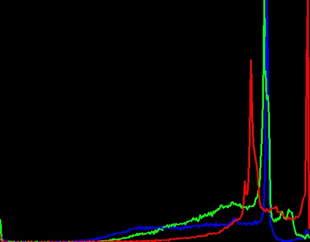

# Color Channels and Histograms
## Color Channels
<p>Digital images are made up of pixels and these pixels are combination of primary colors. A color channel stores the color information of one one such color. Different kinds of digital images have different color channels.<p>
<p>An RGB image has 3 channels: Red channel, Green channel and Blue channel. Each coor channel in an RGB image has 256 intensity levels.<p>

|  | |  | |
|:--:|:--:|:--:|:--:|
| RGB Image | The blue channel displayed as greyscale. |The green channel dispayed as greyscale.| The red channel displayed as greyscale. |

<p>The particular color channel's brightness determines the intensity of that color in the picture. In the blue channel, the blue parts are much brighter than in other channels. The red flowers are brighter in the red channel comparatively and same goes for the green parts of the picture in the green channel.<p>
<p>Similarly,  in a YUV image, Y channel correlates the percieved intensity while the U and V correlated the color information. For a CYMK image the chennels are for Cyan, Yellow, Magenta and Black. Each color channel has 100 intensity levels.<p>

## Histograms
Histograms are typically graphical representation of distribution of data. An image histogram gives the graphical representation of counts of colour intensities in a digital image. It can also count other features like directions and gradients along with intensities. It does not give indication of location of pixels. 
The x-axis indicates the range of values the variable can take. This range can be divided into a series of intervals called bins. The y-axis shows the count of how many values fall within that interval or bin.

When plotting the histogram we have the pixel intensity in the X-axis and the frequency in the Y-axis. As any other histogram we can decide how many bins to use.

A histogram can be calculated both for the gray-scale image and for the colored image. In the first case we have a single channel, hence a single histogram. In the second case we have 3 channels, hence 3 histograms.

Calculating the histogram of an image is very useful as it gives an intuition regarding some properties of the image such as the tonal range, the contrast and the brightness.

### Creating histograms for RGB image
In order to create histogram, we load the source image we need to create a histogram of and split them into three channels; Blue(B),Green(G) and Red(R) respectively.
```c++
string path = "resources/pic.jpg";
Mat img= imread(path);
vector <Mat> bgr_planes;
split(img,bgr_planes);
```
We have to initialize a size for histogram, which is 256 since RGB has 256 intensity levels. The range for it will also be 0 to 255. The range for histogram should be initialized such that:
```c++
float range[] = {0,256};
const float *histRange = {range};
```
This is done so because out CalcHist function only takes double pointers for the range of histogram. The size, height, width of the histogram are integers. The output of the calcHist is stored in Mat class variables for three channels.
```
int Size=256,height=512,width=400;
Mat blueH,greenH,redH;
```
We want our bins to have same size and clear the histograms, if any were built before this.
```
bool uniform = true, accumulate = false;
```
The calcHist function takes a total of 10 arguments. These are separately calculated for each channel.(B,G and R)
```
calcHist(&bgr_planes[0],1,0,Mat(),blueH,1,&histSize,&histRange,uniform,accumulate);
calcHist(&bgr_planes[1],1,0,Mat(),greenH,1,&histSize,&histRange,uniform,accumulate);
calcHist(&bgr_planes[2],1,0,Mat(),redH,1,&histSize,&histRange,uniform,accumulate);
```
The arguments are 
- &bgr_planes: The source image
- 1: The number of images we use
- 0: The number of dimensions to be measured. Only intensity is measured so its 0.
- Mat(): This is used for masking, i.e. to determine which part of the image is analyzed. Empty mask means we're checking the entire image.
- blueH : This is where the output of the function is stored.
- 1: The dimensionality of the output histogram. Its 2D so we write one.
- histSize: this determines the number of bins used to measure inensity.
- histRange: The range of values to be measured 
- accumulate and uniform: The bin sizes are kept uniform and histogram is cleared.

We then create an image to  display histograms make an appropriate bin size:
```c++
int bin = cvRound((double)width/Size);
Mat Image(height,width, CV_8UC3,Scalar(0,0,0));
```
where CV_8UC3 is an 8 bit unsigned integer matrix with 3 channels. It is important to normalize histograms so the values fall in the certain range.

```c++
normalize(blueH, blueH, 0, histImage.rows, NORM_MINMAX, -1, Mat() );
normalize(greenH, greenH, 0, histImage.rows, NORM_MINMAX, -1, Mat() );normalize(redH, redH, 0, histImage.rows, NORM_MINMAX, -1, Mat() );
```
We now draw histograms for respective color channels:
```c++
    for( int i = 1; i < histSize; i++ )
    {
        line( Image, Point( bin*(i), height - cvRound(blueH.at<float>(i)) ),
              Point( bin*(i+1), height - cvRound(blueH.at<float>(i+1)) ),
              Scalar( 255, 0, 0), 2, 8, 0  );
        line( Image, Point( bin*(i), height - cvRound(greenH.at<float>(i)) ),
              Point( bin*(i+1), height - cvRound(greenH.at<float>(i+1)) ),
              Scalar( 0, 255, 0), 2, 8, 0  );
        line( Image, Point( bin*(i), height - cvRound(redH.at<float>(i)) ),
              Point( bin*(i+1), height - cvRound(redH.at<float>(i+1)) ),
              Scalar( 0, 0, 255), 2, 8, 0  );
    }
```
|The histograms are plotted in this way |
|----|
||

The histogram of light and dark toned image samples is given below:

|||
|:--:|:--|
|Dark toned image|Histogram of dark toned image|
|||
|Light toned image|Histogram of light toned image|

From the plot of the dark toned image we can infer that the channels have very low intensities of pixels, corresponding to the amount of dark blue and the black color present int the image. Here the histogram plot las skewed left, refering to the low intensities near origin.If most of the pixels are found on the left hand side of your image, it is most likely that your image is under-exposed and will be too dark and lack details in the shadow areas.

From the plot of the light toned image we can infer that the channels have very hight intensities of pixels, corresponding to the amount of light skin and yellow pigment present int the image. Here the histogram plot has skewed right, refering to the high intensities. If the majority of the pixels are found on the right hand side then the photo is most likely to be over-exposed and will be too light with little or no detail in bright parts of the image.


### Histograms for Greyscale images
We need to make a few changes in the code above in order to determine the histogram for greyscale images. It is not necessary to split the image into channels but it is required that the source image is converted into greyscale.
```c++
cvtColor(src,grey,COLOR_BGR2GRAY);
```
While trying to make a grayscale image, we should also make sure that the image intitalization for the plotting of histogram should be like this:
```c++
Mat Image(height,width, CV_8UC1,Scalar(0,0,0));
```
where CV_8UC1 is an 8 bit unsigned integer matrix with 1 channel.

The sample greyscale images and their respective histograms are given below:
|||
|:--:|:--|
|Low contrast image|Histogram of low contrast image|
|||
|High contrast image|Histogram of high contrast image|

An image with low contrast will generally have a sharp peak on the histogram while an image with more contrast will have a more a rounded peak.
We can see from the figure above how the pixel intensities affects the contrast of the images. Foe the low contrast image, we can see that most of the histogram is concentrated on one side of the graph, i.e there aren't many distinct intensities when it comes to a low contrast image.

Similarly for the high contrast image, it is obvious that the entire histogram is spread apart, meaning that high contrast images have more distinct number of intensities in their image pixels.